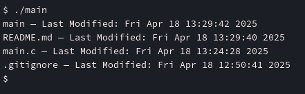
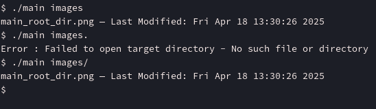

# aspz-p7

## Навігація по README.md:

- [Завдання за варіантом](#завдання-за-варіантом-3)

## Завдання за варіантом №3

Розробіть засіб, що аналізує, які файли у вказаній директорії змінювалися найчастіше за останні 7 днів, використовуючи лише доступні через стандартну бібліотеку функції C.

Прочитавши про функції в стандартній бібліотеці C, дізнався про stat() - який показує останню дату модифікації файлу.

Так як у стандартній бібліотеці немає функцій, які можуть визначати скільки раз був відкритий файл (як сказано в умові задачі, не востаннє, а "найчастіше" за останні 7 днів), то трактую умову задачі як вивід файлів у вказаній директорії, які змінювалися востаннє за останні 7 днів.

Написав наступну програму на C - [main.c](./main.c)

```c
#include <stdio.h>
#include <stdlib.h>
#include <string.h>
#include <dirent.h>
#include <errno.h>
#include <sys/stat.h>
#include <time.h>

#define MAX_FILE_COUNT 256

struct FileInfo {
    char name[256];
    time_t mtime;
};

int compare_mtime(const void* a, const void* b);

int main(int argc, char **argv) {
    // directory and arguments
    DIR* FD;
    struct dirent* in_file;
    char* target_dir = (argc>1) ? (char *)argv[1] : ".";
    
    // opening it
    FD = opendir(target_dir);
    if (FD == NULL) {
        fprintf(stderr, "Error : Failed to open target directory - %s\n", strerror(errno));
        return 1;
    }

    // going trhough the files
    struct FileInfo files[MAX_FILE_COUNT];
    int file_count = 0;
    while ((in_file = readdir(FD))) {
        if (DT_REG == in_file->d_type) {
            //printf("%s is a file\n", in_file->d_name);

            struct stat fileStat;
            char path_file[256];
            snprintf(path_file, sizeof(path_file), "%s/%s", target_dir, in_file->d_name);

            if (stat(path_file, &fileStat) < 0) {
                perror("Error: Failed to get the stats of a file");
                return 1;
            }

            // saving the file data (name & modification time) in our struct
            if (file_count < MAX_FILE_COUNT) {
                strncpy(files[file_count].name, in_file->d_name, sizeof(files[file_count].name));
                files[file_count].mtime = fileStat.st_mtime;
                file_count++;
            }            
        }
    }

    // sort
    qsort(files, file_count, sizeof(struct FileInfo), compare_mtime);
    
    // last 7 days
    time_t now = time(NULL);
    time_t seven_days_ago = now - 7 * 24 * 60 * 60;

    // print results
    for (int i = 0; i < file_count; i++) {
        if (files[i].mtime >= seven_days_ago) {
            printf("%s — Last Modified: %s", files[i].name, ctime(&files[i].mtime));
        }
    }    
    
    closedir(FD);
    
    return 0;
}

// function to compare mtime
int compare_mtime(const void* a, const void* b) {
    struct FileInfo* f1 = (struct FileInfo*)a;
    struct FileInfo* f2 = (struct FileInfo*)b;
    return (f2->mtime - f1->mtime);
}
```

Запустимо цю програму:



Програма отримує останню зміну файлу і сортує список.

Давайте звіримось, що все працює, вказавши інший шлях до файлів:



Як бачимо, програма працює.