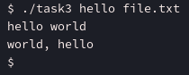

# aspz-p7

## Навігація по README.md:

- [Завдання 7.1](#завдання-71)
- [Завдання 7.2](#завдання-72)
- [Завдання 7.3](#завдання-73)
- [Завдання 7.4](#завдання-74)
- [Завдання 7.5](#завдання-75)
- [Завдання 7.6](#завдання-76)
- [Завдання 7.7](#завдання-77)
- [Завдання 7.8](#завдання-78)
- [Завдання 7.9](#завдання-79)
- [Завдання 7.10](#завдання-710)
- [Завдання за варіантом](#завдання-за-варіантом-3)

## Завдання 7.1

    Використайте popen(), щоб передати вивід команди rwho (команда UNIX) до more (команда UNIX) у програмі на C.

Написав наступну програму: [task1.c](./task1.c)

```c
#include <stdio.h>
#include <stdlib.h>

int main() {
    FILE *fp;
    char buffer[1024];

    fp = popen("rwho | more", "r");

    if (fp == NULL) {
        perror("popen failed");
        exit(EXIT_FAILURE);
    }

    while (fgets(buffer, sizeof(buffer), fp) != NULL) {
        fputs(buffer, stdout);
    }

    int status = pclose(fp);

    printf("Finished the commad `rwho | more` with status: %d\n", status);

    return 0;
}
```


## Завдання 7.2

    Напишіть програму мовою C, яка імітує команду ls -l в UNIX — виводить список усіх файлів у поточному каталозі та перелічує права доступу тощо.
    (Варіант вирішення, що просто виконує ls -l із вашої програми, — не підходить.)

Написав наступну програму - [task2.c](./task2.c)

```c
#include <stdio.h>
#include <stdlib.h>
#include <dirent.h>
#include <sys/stat.h>
#include <pwd.h>
#include <grp.h>
#include <time.h>
#include <string.h>
#include <unistd.h>

void print_permissions(mode_t mode) {
    char perms[11] = {'-'};

    if (S_ISDIR(mode)) perms[0] = 'd';
    else if (S_ISLNK(mode)) perms[0] = 'l';
    else if (S_ISCHR(mode)) perms[0] = 'c';
    else if (S_ISBLK(mode)) perms[0] = 'b';
    else if (S_ISSOCK(mode)) perms[0] = 's';
    else if (S_ISFIFO(mode)) perms[0] = 'p';

    perms[1] = (mode & S_IRUSR) ? 'r' : '-';
    perms[2] = (mode & S_IWUSR) ? 'w' : '-';
    perms[3] = (mode & S_IXUSR) ? 'x' : '-';

    perms[4] = (mode & S_IRGRP) ? 'r' : '-';
    perms[5] = (mode & S_IWGRP) ? 'w' : '-';
    perms[6] = (mode & S_IXGRP) ? 'x' : '-';

    perms[7] = (mode & S_IROTH) ? 'r' : '-';
    perms[8] = (mode & S_IWOTH) ? 'w' : '-';
    perms[9] = (mode & S_IXOTH) ? 'x' : '-';

    perms[10] = '\0';

    printf("%s ", perms);
}

int main(int argc, char *argv[]) {
    const char *target_dir = (argc > 1) ? argv[1] : ".";
    DIR *dir = opendir(target_dir);
    if (!dir) {
        perror("opendir");
        return 1;
    }

    struct dirent *entry;
    char path[512];
    struct stat fileStat;

    while ((entry = readdir(dir)) != NULL) {
        if (entry->d_name[0] == '.') continue;

        snprintf(path, sizeof(path), "%s/%s", target_dir, entry->d_name);
        if (stat(path, &fileStat) == -1) {
            perror("stat");
            continue;
        }

        print_permissions(fileStat.st_mode);

        printf("%2ld ", (long)fileStat.st_nlink);

        struct passwd *pw = getpwuid(fileStat.st_uid);
        struct group  *gr = getgrgid(fileStat.st_gid);
        printf("%s %s ", pw ? pw->pw_name : "?", gr ? gr->gr_name : "?");

        printf("%6ld ", (long)fileStat.st_size);

        char timebuf[64];
        struct tm *tm_info = localtime(&fileStat.st_mtime);
        strftime(timebuf, sizeof(timebuf), "%b %d %H:%M", tm_info);
        printf("%s ", timebuf);

        printf("%s\n", entry->d_name);
    }

    closedir(dir);
    return 0;
}
```


## Завдання 7.3

    Напишіть програму, яка друкує рядки з файлу, що містять слово, передане як аргумент програми (проста версія утиліти grep в UNIX).

Написав наступну програму - [task3.c](./task3.c)

```c
#include <stdio.h>
#include <stdlib.h>
#include <string.h>

#define LINE_LENGTH 1024

int main(int argc, char *argv[]) {
    if (argc != 3) {
        fprintf(stderr, "Usage: %s <word> <filename>\n", argv[0]);
        return 1;
    }

    const char *search_word = argv[1];
    const char *filename = argv[2];

    FILE *fp = fopen(filename, "r");
    if (!fp) {
        perror("Error opening file");
        return 1;
    }

    char line[LINE_LENGTH];
    while (fgets(line, sizeof(line), fp)) {
        if (strstr(line, search_word)) {
            printf("%s", line);
        }
    }

    fclose(fp);
    printf("\n");
    return 0;
}
```

Для цією програми створив файл [file.txt](./file.txt), з наступним вмістом:

```
hello world
goodbye world
world, hello
```

Запускаємо програму:



## Завдання 7.4

    Напишіть програму, яка виводить список файлів, заданих у вигляді аргументів, з зупинкою кожні 20 рядків, доки не буде натиснута клавіша (спрощена версія утиліти more в UNIX).

Написав наступну програму - [task4.c](./task4.c)

```c
#include <stdio.h>
#include <stdlib.h>

#define LINES 20
#define LINE_LENGTH 1024

void show_file(const char *filename) {
    FILE *fp = fopen(filename, "r");
    if (!fp) {
        perror(filename);
        return;
    }

    char line[LINE_LENGTH];
    int line_count = 0;

    while (fgets(line, sizeof(line), fp)) {
        fputs(line, stdout);
        line_count++;

        if (line_count == LINES) {
            printf("\npresse enter to continue");
            getchar();
            line_count = 0;
        }
    }

    fclose(fp);
}

int main(int argc, char *argv[]) {
    if (argc < 2) {
        fprintf(stderr, "usage: %s <file1> [file2 file3 ...]\n", argv[0]);
        return 1;
    }

    for (int i = 1; i < argc; i++) {
        printf("===== %s =====\n", argv[i]);
        show_file(argv[i]);
    }

    printf("\n");
    return 0;
}
```

Перевіряємо з [longfile.txt](./longfile.txt):


Усе працює.

## Завдання 7.5

    Напишіть програму, яка перелічує всі файли в поточному каталозі та всі файли в підкаталогах.

Написав наступну програму - [task5.c](./task5.c)

```c
#include <stdio.h>
#include <stdlib.h>
#include <dirent.h>
#include <unistd.h>
#include <errno.h>
#include <sys/stat.h>
#include <string.h>

void list_dir(const char *path) {
    DIR *dir = opendir(path);
    if (!dir) {
        perror(path);
        return;
    }

    struct dirent *entry;
    char full_path[1024];

    printf("\n[%s]\n", path);

    while ((entry = readdir(dir)) != NULL) {
        if (strcmp(entry->d_name, ".") == 0 || strcmp(entry->d_name, "..") == 0)
            continue;

        snprintf(full_path, sizeof(full_path), "%s/%s", path, entry->d_name);

        struct stat st;
        if (stat(full_path, &st) == -1) {
            perror("stat");
            continue;
        }

        if (S_ISDIR(st.st_mode)) {
            list_dir(full_path);
        } else {
            printf("%s\n", full_path);
        }
    }

    closedir(dir);
}

int main() {
    list_dir(".");
    return 0;
}
```

Запускаємо:


## Завдання 7.6

    Напишіть програму, яка перелічує лише підкаталоги у алфавітному порядку.

Написав наступну програму - [task6.c](./task6.c)

```c
#include <stdio.h>
#include <stdlib.h>
#include <dirent.h>
#include <string.h>
#include <sys/stat.h>

#define MAX_DIRS 1024

int is_directory(const char *name) {
    struct stat st;
    if (stat(name, &st) == 0 && S_ISDIR(st.st_mode)) {
        return 1;
    }
    return 0;
}

int cmp(const void *a, const void *b) {
    return strcmp(*(const char **)a, *(const char **)b);
}

int main() {
    DIR *dir;
    struct dirent *entry;
    char *dirs[MAX_DIRS];
    int count = 0;

    dir = opendir(".");
    if (!dir) {
        perror("opendir");
        return 1;
    }

    while ((entry = readdir(dir)) != NULL) {
        if (strcmp(entry->d_name, ".") == 0 || strcmp(entry->d_name, "..") == 0)
            continue;

        if (entry->d_type == DT_DIR || is_directory(entry->d_name)) {
            if (count < MAX_DIRS) {
                dirs[count] = strdup(entry->d_name);
                count++;
            }
        }
    }
    closedir(dir);

    qsort(dirs, count, sizeof(char *), cmp);

    printf("Subdirectories (sorted):\n");
    for (int i = 0; i < count; i++) {
        printf("%s\n", dirs[i]);
        free(dirs[i]);
    }

    return 0;
}
```

Звіримось:


## Завдання 7.7

    Напишіть програму, яка показує користувачу всі його/її вихідні програми на C, а потім в інтерактивному режимі запитує, чи потрібно надати іншим дозвіл на читання (read permission); у разі ствердної відповіді — такий дозвіл повинен бути наданий.

Написав наступну програму - [task7.c](./task7.c)

```c
#include <stdio.h>
#include <stdlib.h>
#include <string.h>
#include <dirent.h>
#include <sys/stat.h>
#include <unistd.h>

#define MAX_NAME_LEN 256

int has_c_extension(const char *filename) {
    size_t len = strlen(filename);
    return len > 2 && strcmp(filename + len - 2, ".c") == 0;
}

int main() {
    DIR *dir;
    struct dirent *entry;

    dir = opendir(".");
    if (!dir) {
        perror("opendir");
        return 1;
    }

    while ((entry = readdir(dir)) != NULL) {
        if (entry->d_type != DT_REG)
            continue;

        if (!has_c_extension(entry->d_name))
            continue;

        printf("File: %s\n", entry->d_name);
        printf("Grant others read permission? (y/n): ");
        
        char answer[8];
        if (!fgets(answer, sizeof(answer), stdin)) {
            perror("fgets");
            break;
        }

        if (answer[0] == 'y' || answer[0] == 'Y') {
            struct stat st;
            if (stat(entry->d_name, &st) != 0) {
                perror("stat");
                continue;
            }

            mode_t new_mode = st.st_mode | S_IROTH;
            if (chmod(entry->d_name, new_mode) != 0) {
                perror("chmod");
            } else {
                printf("Permission granted to others for %s\n", entry->d_name);
            }
        } else {
            printf("Skipped %s\n", entry->d_name);
        }

        printf("\n");
    }

    closedir(dir);
    return 0;
}
```

Запустимо програму:


## Завдання 7.8

    Напишіть програму, яка надає користувачу можливість видалити будь-який або всі файли у поточному робочому каталозі. Має з’являтися ім’я файлу з запитом, чи слід його видалити.

Написав наступну програму - [task8.c](./task8.c)

```c
#include <stdio.h>
#include <stdlib.h>
#include <dirent.h>
#include <string.h>
#include <unistd.h>
#include <sys/types.h>
#include <sys/stat.h>

int is_regular_file(const char *path) {
    struct stat path_stat;
    if (stat(path, &path_stat) != 0) {
        return 0;
    }
    return S_ISREG(path_stat.st_mode);
}

int main() {
    DIR *dir;
    struct dirent *entry;

    dir = opendir(".");
    if (!dir) {
        perror("opendir");
        return 1;
    }

    while ((entry = readdir(dir)) != NULL) {
        if (strcmp(entry->d_name, ".") == 0 || strcmp(entry->d_name, "..") == 0)
            continue;

        if (!is_regular_file(entry->d_name))
            continue;

        printf("Delete file \"%s\"? (y/n): ", entry->d_name);
        char response[8];
        if (!fgets(response, sizeof(response), stdin)) {
            perror("fgets");
            continue;
        }

        if (response[0] == 'y' || response[0] == 'Y') {
            if (unlink(entry->d_name) == 0) {
                printf("Deleted \"%s\".\n", entry->d_name);
            } else {
                perror("unlink");
            }
        } else {
            printf("Skipped \"%s\".\n", entry->d_name);
        }
    }

    closedir(dir);
    return 0;
}
```

Запускаємо:


## Завдання 7.9

    Напишіть програму на C, яка вимірює час виконання фрагмента коду в мілісекундах.

Написав наступну програму - [task9.c](./task9.c)

```c
#include <stdio.h>
#include <sys/time.h>
#include <unistd.h>

int main() {
    struct timeval start, end;

    gettimeofday(&start, NULL);

    for (volatile int i = 0; i < 100000000; ++i);

    gettimeofday(&end, NULL);

    long seconds = end.tv_sec - start.tv_sec;
    long microseconds = end.tv_usec - start.tv_usec;
    double elapsed_ms = seconds * 1000.0 + microseconds / 1000.0;

    printf("Elapsed time: %.3f milliseconds\n", elapsed_ms);

    return 0;
}
```

Дивимось, чи все працює:


## Завдання 7.10

    Напишіть програму мовою C для створення послідовності випадкових чисел з плаваючою комою у діапазонах:
    (a) від 0.0 до 1.0
    (b) від 0.0 до n, де n — будь-яке дійсне число з плаваючою точкою.
    Початкове значення генератора випадкових чисел має бути встановлене так, щоб гарантувати унікальну послідовність.
    Примітка: використання прапорця -Wall під час компіляції є обов’язковим.

Написав наступну програму - [task10.c](./task10.c)

```c
#include <stdio.h>
#include <stdlib.h>
#include <time.h>

float rand_float_0_1() {
    return (float)rand() / (float)RAND_MAX;
}

float rand_float_0_n(float n) {
    return rand_float_0_1() * n;
}

int main() {
    srand((unsigned int)time(NULL));

    int count = 10;
    float n;

    printf("Enter a floating-point number n for range [0.0, n]: ");
    if (scanf("%f", &n) != 1 || n <= 0.0f) {
        fprintf(stderr, "Invalid input. Must be a positive float.\n");
        return 1;
    }

    printf("\nRandom floats in [0.0, 1.0]:\n");
    for (int i = 0; i < count; ++i) {
        printf("%.6f ", rand_float_0_1());
    }

    printf("\n\nRandom floats in [0.0, %.2f]:\n", n);
    for (int i = 0; i < count; ++i) {
        printf("%.6f ", rand_float_0_n(n));
    }

    printf("\n");
    return 0;
}
```

Компілєьмо з -Wall і запускаємо:


Усе працює.

## Завдання за варіантом №3

    Розробіть засіб, що аналізує, які файли у вказаній директорії змінювалися найчастіше за останні 7 днів, використовуючи лише доступні через стандартну бібліотеку функції C.

Прочитавши про функції в стандартній бібліотеці C, дізнався про stat() - який показує останню дату модифікації файлу.

Так як у стандартній бібліотеці немає функцій, які можуть визначати скільки раз був відкритий файл (як сказано в умові задачі, не востаннє, а "найчастіше" за останні 7 днів), то трактую умову задачі як вивід файлів у вказаній директорії, які змінювалися востаннє за останні 7 днів.

Написав наступну програму на C - [main.c](./main.c)

```c
#include <stdio.h>
#include <stdlib.h>
#include <string.h>
#include <dirent.h>
#include <errno.h>
#include <sys/stat.h>
#include <time.h>

#define MAX_FILE_COUNT 256

struct FileInfo {
    char name[256];
    time_t mtime;
};

int compare_mtime(const void* a, const void* b);

int main(int argc, char **argv) {
    // directory and arguments
    DIR* FD;
    struct dirent* in_file;
    char* target_dir = (argc>1) ? (char *)argv[1] : ".";
    
    // opening it
    FD = opendir(target_dir);
    if (FD == NULL) {
        fprintf(stderr, "Error : Failed to open target directory - %s\n", strerror(errno));
        return 1;
    }

    // going trhough the files
    struct FileInfo files[MAX_FILE_COUNT];
    int file_count = 0;
    while ((in_file = readdir(FD))) {
        if (DT_REG == in_file->d_type) {
            //printf("%s is a file\n", in_file->d_name);

            struct stat fileStat;
            char path_file[256];
            snprintf(path_file, sizeof(path_file), "%s/%s", target_dir, in_file->d_name);

            if (stat(path_file, &fileStat) < 0) {
                perror("Error: Failed to get the stats of a file");
                return 1;
            }

            // saving the file data (name & modification time) in our struct
            if (file_count < MAX_FILE_COUNT) {
                strncpy(files[file_count].name, in_file->d_name, sizeof(files[file_count].name));
                files[file_count].mtime = fileStat.st_mtime;
                file_count++;
            }            
        }
    }

    // sort
    qsort(files, file_count, sizeof(struct FileInfo), compare_mtime);
    
    // last 7 days
    time_t now = time(NULL);
    time_t seven_days_ago = now - 7 * 24 * 60 * 60;

    // print results
    for (int i = 0; i < file_count; i++) {
        if (files[i].mtime >= seven_days_ago) {
            printf("%s — Last Modified: %s", files[i].name, ctime(&files[i].mtime));
        }
    }    
    
    closedir(FD);
    
    return 0;
}

// function to compare mtime
int compare_mtime(const void* a, const void* b) {
    struct FileInfo* f1 = (struct FileInfo*)a;
    struct FileInfo* f2 = (struct FileInfo*)b;
    return (f2->mtime - f1->mtime);
}
```

Запустимо цю програму:


Програма отримує останню зміну файлу і сортує список.

Давайте звіримось, що все працює, вказавши інший шлях до файлів:


Як бачимо, програма працює.